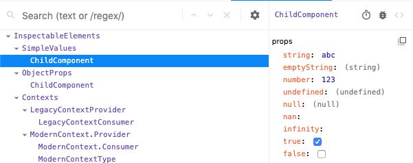
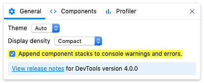
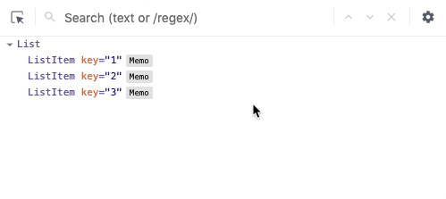
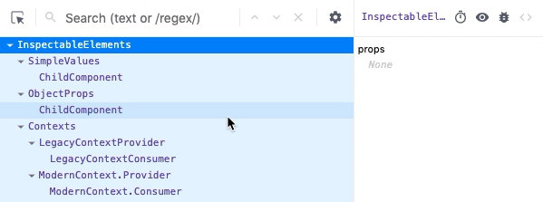
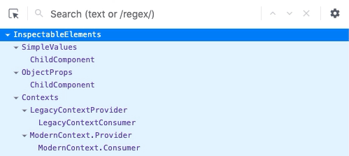
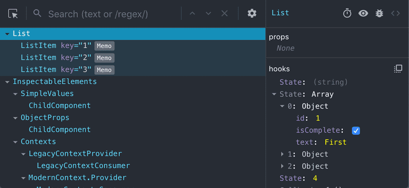

# Guide to React DevTools
  

React Developers Tools is a Browser Extension that makes debugging easy and a developer's life simple. It allows you to inspect the React component hierarchy providing a view of the component tree and the current state & props of each component.
We will learn how to utilize DevTools in debugging React and React Native app. Let's get started.

## Table of Content
1. Installing DevTools
2. Inspecting our App
3. Setup for React Native
4. Features
5. Profiler

## Installing DevTools
You can install DevTools extension on either of the two browsers i.e. Chrome or Firefox. You can visit the extension page for your browser of choice or visit the link below to install the extension.
* [DevTools for Firefox](https://addons.mozilla.org/en-US/firefox/addon/react-devtools/)
* [DevTools for Chrome](https://chrome.google.com/webstore/detail/react-developer-tools/fmkadmapgofadopljbjfkapdkoienihi?hl=en)

That's it. No extra setup is needed (unless you're using React Native). You can verify the extension by looking for the *React logo* next to the address bar.  

## Setup for React Native
In the case of React Native, we have to install `react-devtools` package to enable all the features as we are using a standalone shell not a browser.  
Install the `react-devtools` package globally:

with yarn:
```shell
yarn global add react-devtools
```
or with npm:
```shell
npm install -g react-devtools
```
Now run `react-devtools` from the terminal to launch the standalone DevTools app:
```shell
react-devtools
```

## Inspecting our App
You can open React DevTools in your browser by right-clicking and selecting *Inspect*. `"Components"` and `"Profiler"` tabs will appear to the right which we will use to debug our app.
You can visit this [link](https://react-devtools-tutorial.now.sh/element-selector-tool) to see these two in action.  

## Features
#### View the component hierarchy
You can browse through the component tree and get a better understanding of the structure of your app. React elements can be selected to view extra information about that component.

#### Check props that a component is receiving at a time.  
Selected React elements have a real-time view of the instance’s state, props, and hooks. This is great for debugging!  



### Component stacks
Render stack shows where the props are coming from so it's easier to debug. It also provides a way to log warnings that include the React **component stack**.  



#### Component filters
Large component trees can sometimes be hard to navigate. DevTools now provides a way to filter components so that you can hide ones you're not interested in seeing.  



#### "Rendered by" list
`"Rendered by"` list will reveal the history of props and where they are coming from. In React, an element's "owner" refers to the thing that rendered it. Sometimes an element's parent is also its owner, but usually, they're different. This distinction is important because props come from owners.  
DevTools adds a new `"rendered by"` list in the right-hand pane that allows you to quickly step through the list of owners to speed up your debugging.  

  

#### Owners tree
The inverse of the "rendered by" list is called the "owners tree". Owners tree will show a list of things rendered by a particular component. Just double click a component and it will show all the things *it owns*.  

  

#### Support for React Hooks, including inspecting nested object.
Hooks now have the same level of support as props and state: values can be edited, arrays and objects can be drilled into, etc.


## Profiler
A Profiler is a powerful tool for performance tuning React Components. The Profiler measures how often a React application renders and what the “cost” of rendering is. By "cost", I mean that when each component rendered, how many times it got rendered and at what speed. It collects timing information about components to explain how fast or your slow app is.

### Start Profiler
Open the browser developer tools by right-clicking anywhere on the page and clicking "Inspect". Then select the "⚛ Profiler" tab where you will a blue circle ● at the left most corner to "Start Profiling" the application.

### Understanding Performance Data
Conceptually, React does work in two phases:
* The render phase determines what changes need to be made to e.g. the DOM. During this phase, React calls render and then compares the result to the previous render.
* The commit phase is when React applies any changes.  

The profiler runs for as long as your application renders until you hit the stop button. After you hit stop, you will see some form of bars and charts. Let's understand these charts.

#### Flamegraph
Each bar in the chart represents a React component. The size and color of the bar represent how long it took to render the component and its children. (The width of a bar represents how much time was spent when the component last rendered and the color represents how much time was spent as part of the current commit.)    


#### Ranked Chart
The ranked chart view of representing performance shows a React component in bar format. It is arranged in descending order, with the components that took the longest to render at the top. A component's rendering time also includes the time it took to render the children components. 


#### Interactions
Interactions are used for tracing the cause of an update. “Interactions” traced with this API will also be shown in the profiler. Example: *Scroll to row 200*, *Scroll to row 300*, etc.

### What's new in Profiler?
1. Profiler data can now be exported and shared with others. developers to enable easier collaboration.

2. "Why did this render?" is a common question when profiling. The profiler now helps answer this question by recording which props and state change between renders.

3. The profiler now displays a list of each time the selected component rendered during a profiling session, along with the duration of each render. This list can be used to quickly jump between commits when analyzing the performance of a specific component.

I hope this guide serves it's purpose and explains the benefits of using React DevTools to debug your React app. Happy Debugging!!
